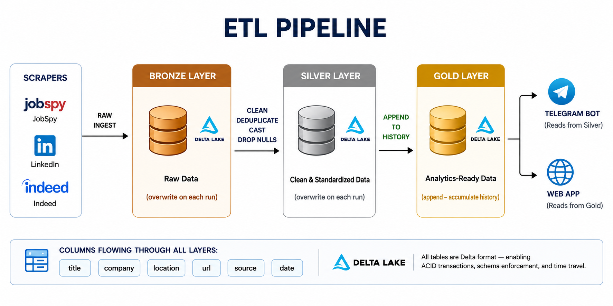

<div align="center">
<div align="center">
  
</div>
# 🔎 Shoghla — Automated Tech Job Intelligence Platform

*Every job worth applying to, in one place*

---


</div>

---

## 🏆 Project Context

> **DEPI Graduation Project — Data Engineering Track**

**Shoghla** is an end-to-end automated data pipeline that aggregates tech job postings from multiple platforms across the Arab region, processes them through a Bronze → Silver → Gold medallion architecture on **Databricks**, and delivers results through a live web application, a daily **Telegram Bot**, and a **Power BI** analytics dashboard.

---

## 🎯 About the Project

### The Problem

Tech job seekers in Egypt and across the Arab region face a fragmented market:

- **Multiple platforms** — LinkedIn, Indeed, Wuzzuf, Remotive, RemoteOK each require a separate visit.
- **No unified view** — there is no single dashboard covering both local and remote opportunities.
- **Missed listings** — jobs posted within the last 24 hours are easily missed without constant manual checking.
- **No proactive alerts** — candidates must always pull listings rather than having them pushed.
- **No market analytics** — understanding in-demand skills or top hiring companies requires tedious manual aggregation.

### The Solution: Shoghla

We built a fully automated data engineering pipeline that transforms scattered job data into actionable intelligence:

1. **Scraping** — Collects jobs from 4 sources using 4 different strategies (REST API, web scraping, library-based).
2. **ETL** — Runs a Bronze → Silver → Gold pipeline on Databricks with Delta Lake for data quality.
3. **Publishing** — Serves cleaned jobs through a live SSR web application deployed on Vercel.
4. **Alerting** — Pushes new jobs daily to a public Telegram channel (`@Shoghla1`).
5. **Analytics** — Provides market insights via an interactive Power BI dashboard.
6. **Personalization** — Allows users to upload a CV and receive skill-matched job recommendations.

---

## 🚀 Key Features

- **⚡ Automated Daily Pipeline** — Runs every 24 hours; scrapes, cleans, and publishes without manual intervention.
- **🗄️ Medallion Architecture** — Bronze / Silver / Gold Delta tables with ACID guarantees and schema enforcement.
- **🌍 Multi-Source Aggregation** — LinkedIn, Indeed, Wuzzuf, Remotive, and RemoteOK in a single unified schema.
- **📬 Proactive Delivery** — Telegram Bot pushes up to 200 new jobs per run to `@Shoghla1`, deduplicating across runs.
- **📄 Privacy-First CV Parsing** — PDF and DOCX CVs are parsed locally using `pdfjs-dist` + `mammoth` — no data sent to external AI services.
- **🧠 Skill Matching** — 100+ recognized tech skills matched against CV content to produce a `match_percentage` per job.
- **📊 Market Analytics** — Power BI dashboard for trends across companies, locations, sources, and dates.
- **🔐 Secure Auth** — Google Sign-In via Supabase (PKCE flow); saved jobs stored with Row-Level Security enforced.

---

## 🏗️ ETL Pipeline Architecture

<div align="center">
  
</div>

---

## 📂 Repository Structure

```bash
NHA-4-085/
│
├── 🕷️ Scraping/
│   ├── LinkedIn+Indeed_Scrapper.ipynb   # python-jobspy: 30+ keywords × 5 countries
│   ├── Wazzuf_scrapper.py               # Selenium: 4 keywords × 5 pages
│   └── Remotive_Scrapper.py             # REST API: Remotive + RemoteOK
│
├── ⚙️ ETL/
│   ├── Bronze_Layer.ipynb               # Raw ingestion → Delta table (overwrite)
│   ├── Silver_Layer.ipynb               # Clean, deduplicate, cast → Delta (overwrite)
│   └── Gold_layer.ipynb                 # Schema-align → Delta table (append)
│
├── ✈️ TelegramBot/
│   └── Telegram Bot.ipynb               # Daily push to @Shoghla1, dedup via Delta ledger
│
├── 📊 PowerBI/
│   └── shoghla bi.pbip                  # Power BI project file (cvproject.Report)
│
├── 🌍 Shogla_App/                       # Full-stack web application
│   ├── src/
│   │   ├── routes/                      # index.tsx, profile.tsx, auth.callback.tsx
│   │   ├── components/                  # JobCard, CVUploader, RecommendationCard, SavedJobCard
│   │   └── lib/                         # jobs.functions.ts, cv-extract.ts, profile.functions.ts
│   ├── supabase/migrations/             # user_profiles + saved_jobs schema (RLS)
│   ├── .env.example                     # All required environment variables
│   ├── DEPLOYMENT.md                    # Step-by-step Vercel + Supabase + Databricks guide
│   └── package.json
│
├── 🗃️ Data/
│   ├── cleaned_jobs_final.csv           # Primary cleaned dataset (~2.6 MB)
│   ├── jobs_dataset.csv                 # Combined Remotive + RemoteOK output
│   ├── wazzuf.csv                       # Raw Wuzzuf scrape
│   └── remoteOK_*.csv / remotive_*.csv / *_Wuzzuf.csv
│
└── 📸 Screenshots/                      # 10 product screenshots (app UI)
```

---

## 🛠️ Technology Stack

| Layer | Technology |
|---|---|
| **Scraping** | Python, Selenium + ChromeDriver, `python-jobspy`, `requests`, `BeautifulSoup`, `pandas`, `tqdm` |
| **ETL / Processing** | Apache Spark (PySpark), Databricks Notebooks, Delta Lake |
| **Storage** | Databricks Unity Catalog , Delta Tables, Databricks Volumes |
| **Web App** | React 19, TanStack Start (SSR), TanStack Router, TypeScript, Tailwind CSS v4, Radix UI, shadcn/ui, Recharts |
| **Auth** | Supabase Auth — Google OAuth (PKCE flow), `@supabase/ssr` |
| **CV Parsing** | `pdfjs-dist` (PDF), `mammoth` (DOCX), custom keyword engine — fully local, no external AI |
| **Deployment** | Vercel (auto-detected TanStack Start / Nitro preset) |
| **Telegram Bot** | Python, `requests`, Telegram Bot API, Delta Lake dedup ledger |
| **Analytics** | Microsoft Power BI (`.pbip` format — `cvproject.Report`) |
| **Package Manager** | Bun (primary) |
| **Code Quality** | ESLint, Prettier, TypeScript strict mode |

---


## 📊 Data Pipeline Details

### Scraping Sources

| Source | Method | Keywords / Scope |
|---|---|---|
| LinkedIn + Indeed | `python-jobspy` library | 30+ job titles × Egypt, Saudi Arabia, UAE, Qatar, Kuwait |
| Wuzzuf | Selenium + ChromeDriver | AI, Data, Software, IT — 5 pages each |
| Remotive | REST API (`remotive.com/api`) | All remote tech jobs |
| RemoteOK | REST API (`remoteok.com/api`) | All remote tech jobs |

### ETL Layers

| Layer | Table | Write Mode | Key Operations |
|---|---|---|---|
| **Bronze** | `bronze_linkedin_indeed` | Overwrite | Raw ingest, checkpoint resume |
| **Silver** | `silver_linkedin_indeed` | Overwrite | `dropDuplicates()`, `na.drop()`, explicit `cast()` |
| **Gold** | `gold_jobs` | **Append** | Schema alignment, historical accumulation |

### Telegram Bot Logic

- Reads from the **Silver** table.
- Left-anti joins against `telegram_sent_jobs` Delta table to exclude already-sent URLs.
- Safety cap: **200 messages per run**.
- Retry logic: 3 attempts per message, respecting Telegram's `retry_after` on HTTP 429.
- Tracks every sent URL with a timestamp in the `telegram_sent_jobs` ledger.

---

## 🌍 Web Application Features

| Feature | Details |
|---|---|
| **Job Search** | Full-text keyword search across all Gold table listings |
| **Filters** | By source platform, location, date (Anytime / 24h / Week / Month) |
| **Pagination** | 24 jobs per page with smooth transitions |
| **Google Sign-In** | Supabase Auth + PKCE flow |
| **CV Upload** | PDF & DOCX, up to 10 MB — stored in Supabase Storage |
| **CV Parsing** | Local extraction (no external API) → 100+ skill keywords |
| **Saved Jobs** | Bookmarked per user in Supabase (`saved_jobs` table, RLS enforced) |
| **Job Matching** | `match_percentage` + `match_reasons` per job vs. CV skills |
| **Collapsible Sidebar** | Desktop panel + mobile sheet for filters |

---

## 👥 The Team

| Name | Contributions |
|---|---|
| **Abdelrahman Balbaa** | ETL Pipeline, Bronze / Silver / Gold layers, Databricks / WebApp / Presentation  |
| **Philopater Amir** | Web Scraping (LinkedIn + Indeed) / Telegram Bot |
| **Farah Khater** |  Web Scraping (Remotive + RemoteOk) / PowerBI |
| **Hana ELgamal** | Web Scraping (Wazzuf) |
| **Abdelrahman Hamdy** | Documentation |


---


<div align="center">


</div>
